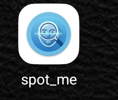
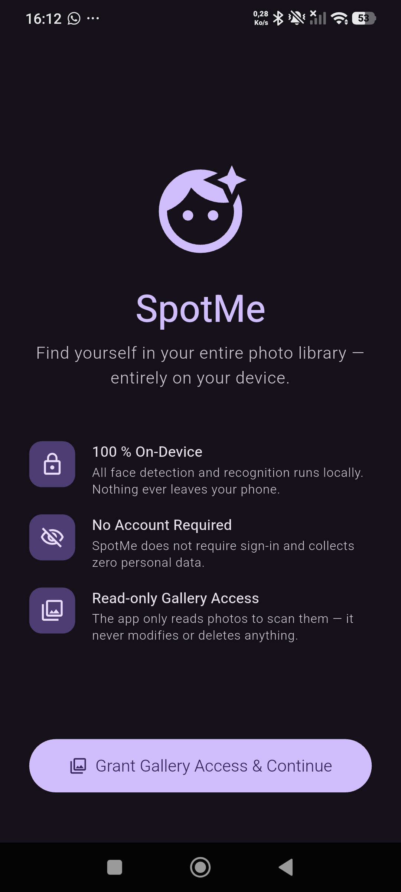
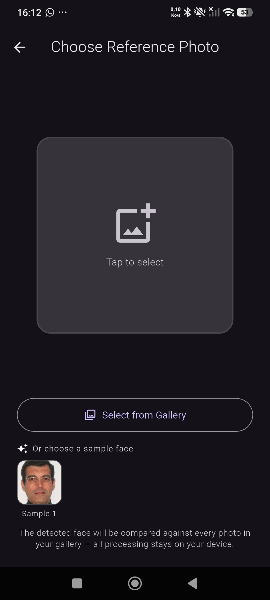
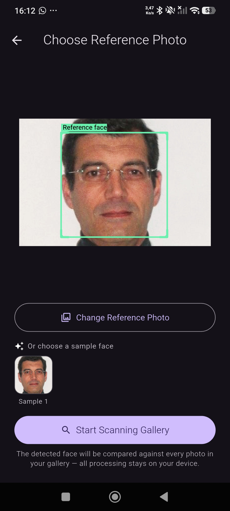
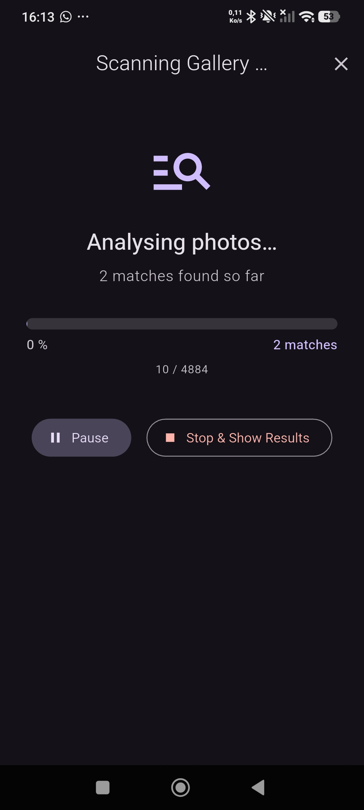
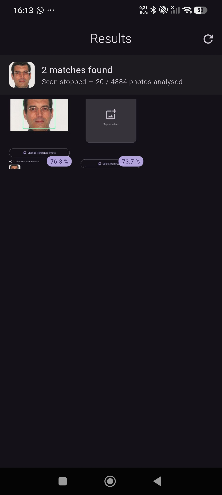
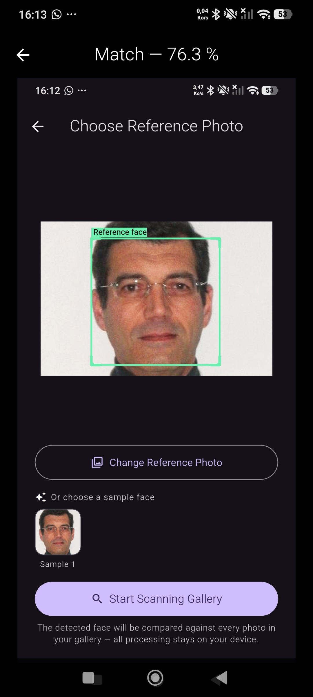

# 🕵️‍♂️ Où est Xavier ?

> Traquez qui vous voulez dans vos photos ! Cette app Flutter 100% locale scanne les visages en arrière-plan. Cherchez Xavier Dupont de Ligonnès ou ajoutez n'importe quelle autre photo de référence. Vos données ne quittent jamais votre téléphone. Une expérience à la "Où est Charlie".

---

## ✨ Fonctionnalités principales

* 🔒 **100% Local (Privacy First) :** Aucun backend, aucune API distante. Vos photos, vos modèles IA et vos résultats ne quittent **jamais** votre téléphone.
* 🎯 **Recherche sur mesure :** Fourni avec un cas d'usage par défaut (XDDL), mais vous pouvez importer **n'importe quel visage de référence** depuis votre galerie pour lancer un scan.
* ⚡ **Haute Performance :** Utilisation des *Dart Isolates* pour exécuter les calculs matriciels complexes en arrière-plan sans bloquer l'interface utilisateur.
* 🖼️ **Analyse de masse :** Parcours intelligent de votre galerie locale grâce au package `photo_manager`.

## 🛠 Stack Technique

* **Framework :** [Flutter](https://flutter.dev/) (Dart)
* **Détection faciale :** `google_mlkit_face_detection` (version On-Device) pour extraire les *bounding boxes* des visages, même en arrière-plan.
* **Reconnaissance & Embeddings :** `tflite_flutter`. Utilisation d'un modèle léger (ex: MobileFaceNet) pour générer des vecteurs faciaux et calculer la distance cosinus/euclidienne.
* **Accès Galerie :** `photo_manager`

---

## 🚀 Installation & Démarrage

### Prérequis
* Un appareil physique Android (recommandé) ou un émulateur.
* Téléchargez et intallez l'application

#⚠️ Limites Connues (Known Issues)
La reconnaissance faciale embarquée a ses limites, surtout sur des photos de vacances :

Faux positifs : Les visages lointains, flous, ou mal éclairés (typiques des arrière-plans) génèrent des embeddings de moins bonne qualité. L'application risque de trouver des correspondances erronées.

Profils : Les modèles légers on-device ont beaucoup de mal à identifier les visages qui ne sont pas de face.

Temps de traitement : Scanner une galerie de 15 000 photos prend du temps. Laissez l'application tourner et surveillez la jauge de progression.

# ⚖️ Avertissement & Disclaimer
Ce projet est une expérimentation technique et éducative. Il n'est en aucun cas un outil professionnel d'investigation ou d'application de la loi. Les résultats de correspondances (matchs) fournis par l'intelligence artificielle embarquée sont indicatifs et sujets à une forte marge d'erreur.

En utilisant cette application, vous vous engagez à respecter les lois de votre pays concernant la vie privée et l'utilisation de données biométriques.

# 🕵️‍♂️ Où est Xavier ?

> Track anyone you want in your photos! This 100% local Flutter app scans background faces. Look for Xavier Dupont de Ligonnès or add any other reference photo. Your data never leaves your phone. An open-source "Where's Waldo" experience.

---

## ✨ Main Features

* 🔒 **100% Local (Privacy First):** No backend, no remote API. Your photos, AI models, and results **never** leave your phone.
* 🎯 **Custom Search:** Comes with a default use case (XDDL), but you can import **any reference face** from your gallery to start a scan.
* ⚡ **High Performance:** Uses *Dart Isolates* to run complex matrix calculations in the background without freezing the user interface.
* 🖼️ **Mass Analysis:** Smart scanning of your local gallery using the `photo_manager` package.

## 🛠 Tech Stack

* **Framework:** [Flutter](https://flutter.dev/) (Dart)
* **Face Detection:** `google_mlkit_face_detection` (On-Device version) to extract bounding boxes of faces, even in the background.
* **Recognition & Embeddings:** `tflite_flutter`. Uses a lightweight model (e.g., MobileFaceNet) to generate facial vectors and calculate cosine/Euclidean distance.
* **Gallery Access:** `photo_manager`

---

## ⚠️ Known Issues

On-device facial recognition has its limits, especially on vacation photos:
* **False Positives:** Distant, blurry, or poorly lit faces (typical of backgrounds) generate lower-quality embeddings. The app may find incorrect matches.
* **Profiles:** Lightweight on-device models struggle to identify faces that are not looking straight ahead.
* **Processing Time:** Scanning a gallery of 15,000 photos takes time. Let the app run and monitor the progress bar.

---

## ⚖️ Warning & Disclaimer

**This project is a technical and educational experiment.** It is by no means a professional investigation or law enforcement tool. Match results provided by the embedded AI are purely indicative and subject to a high margin of error. 

By using this code, you agree to comply with your country's laws regarding privacy and the use of biometric data.

---

# Screenshots

